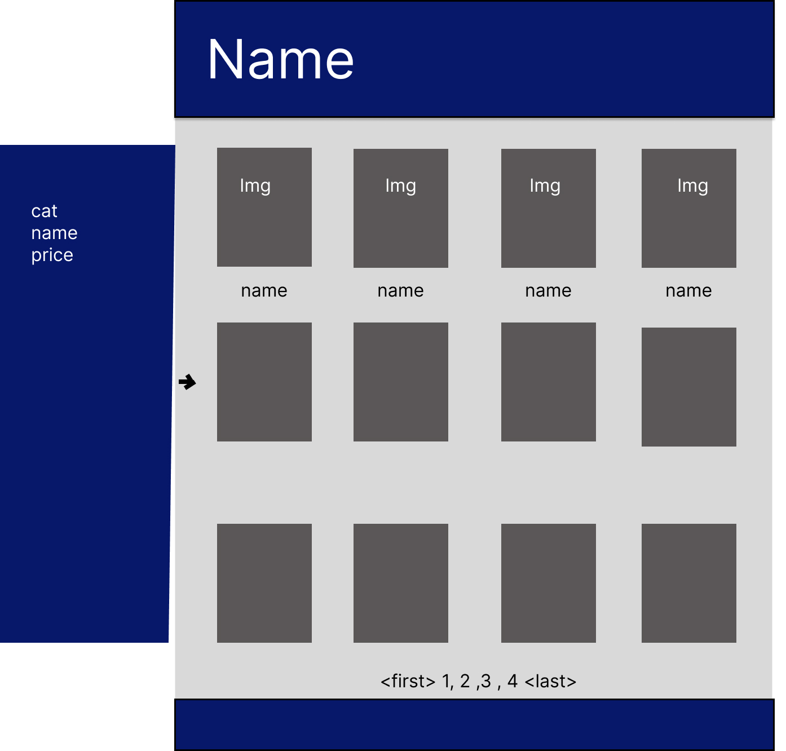

# Gameproject: 4P-4play


## Description

We developed the 4Play fullstack web application for users that has a passion for video games. The website allows the user to create an account, check game information, create comments about the games and also, search games by game name, genres and category. Once the user select a game and click on it, we redirect the user to a page, where he will have access for more information and gallery displaying the some screenshots of the game.

While developing this application, we encrypted the user password before sending it to the database, that will make the password more secure, but not only that, while the user is typing the password, the field will display it as dots, so know one can see it. 


---

### Table of Contents

- [Installation](#installation)
- [Usage](#usage)
- [Technologies](#technologies)
- [User-Story](#user-story)
- [Acceptance-Criteria](#acceptance-criteria)
- [Screenshots](#screenshots)
- [CodeSnippets](#codeSnippets)
- [License](#license)
- [Contributors](#contributors)
- [Tests](#tests)
- [Important-Information-Questions](#important-information-questions)

---

## Installation

Our application contain a seed file that will import data to the database, in order to get this information, you will need to follow the steps below:

1. Create a database name:  game_db
2. Run npm install, so all the npm installation will be ready, including mysql2
3. Make sure you create a .env file with your information, as the database will need permission to upload the data in the database game_db
4. Run the command in your terminal: run npm seed This command will add all the database you need in order to test the system.
5. Run the command in your terminal: npm start, once it is running, than you can access the application from http://localhost:3001

---

## Usage

The home page will load 20 games to the user, displaying the game name and image. In case the user wants to find more about the game, the user need to sign in on our application. Once the user is successfully signed in it can:
 * Select a game to read the description
 * Select a game to see: price, publisher, genres, categories rating and comments
 * Check games by Genres
 * Check game  by Category
 * Search by game name
 * Add comments to the game
 * Add rating to the game (0 - 5)
 * Log out


---

## Technologies

- **MySQL**
- **CSS**
- **bcrypt**
- **Session-Sequelize**
- **JavaScript**
- **Handlebars**
- **Node.js**
- **GitHub**
- **Sequelize**
- **Express**

---

## Screenshots

#### Main Page 




#### Login Page


---

## CodeSnippets

#### Dynamically swaps the  image to the main window, displaying it larger.

``` 
const primary = document.querySelector("#primary");
const screenshots = document.querySelector("#screenShots");
screenshots.addEventListener('click', (event) => {
    const source = event.target.getAttribute('src');
    const description = event.target.getAttribute('alt');
    primary.setAttribute('src', source);
    primary.setAttribute('alt', description);
});
```
#### Encrypt the password before saving it to the database
```
hooks: {
            beforeCreate: async(userPassword) => {
                userPassword.password = await bcrypt.hashSync(userPassword.password, 8);
                return userPassword;
            },
            beforeUpdate: async(userPassword) => {
                userPassword.password = await bcrypt.hashSync(userPassword.password, 8);
                return userPassword;
            },
            beforeBulkCreate: async(userPassword) => {
                userPassword.forEach(async (user) => {
                    user.password = await bcrypt.hashSync(user.password, 8);
                });
            }
        },
```

#### Partials implementation for game comments
``` 
<div class="game_comments">
<p>{{comment}}</p><span>Created by {{user.user_name}} on {{format_date createdAt}}</span>
</div>
```
#### Load the games to the main page
```
<div class="games">
  {{#each displayGames as |game|}}
    <a href="/game/{{game.id}}">
      <div class="game-card">
        
        <h2>{{game.name}}</h2>
      </div>
    </a>
  {{/each}}
</div>

```

---

## Tests

N/A

---

## **Important-Information-Questions**

---

## License

The license used on this project was MIT license

[license link](https://opensource.org/licenses/MIT)

## Contributors

Luiz Borges, Preston Ramsey, Gina Guerrero, and Kyle Vance

## Questions

If you have any questions regarding this project, please reach out to the group at any of our linkedin pages

[Live Link](https://fp-4play.herokuapp.com/)

 * Luiz Borges<br>
[](https://github.com/luizborges146) [](https://www.linkedin.com/in/luiz-borges-2377b7142/)

* Preston Ramsey<br>
[](https://github.com/PRamsey02) [](hhttps://www.linkedin.com/in/preston-ramsey-354ab5244/)

* Gina Guerrero<br>
[](https://github.com/Ginalguerrero) [](https://www.linkedin.com/in/gina-guerrero-3105a9b2/)

* Kyle Vance<br>
[](https://github.com/KVance1010) [](https://www.linkedin.com/in/kyle-s-vance/)
